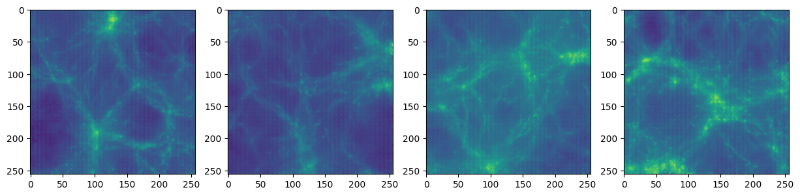

# CosmoDiffusion

Denoising Diffusion Probabilistic Model (DDPM) in Pytorch to generate CAMELS astrophysical maps.

Download images from the [CAMELS Multifield dataset](https://camels-multifield-dataset.readthedocs.io/en/latest/access.html).

In this example we make use of 15k maps of the total mass field at $z=0$ from the LH SIMBA dataset: `Maps_Mtot_SIMBA_LH_z=0.00.npy`

Two different implementations are included:

- `camels_diffusion_model_from_scratch.ipynb`: an implementation from scratch adapted from the tutorial [Diffusion models from scratch in PyTorch](https://www.youtube.com/watch?v=a4Yfz2FxXiY) by DeepFindr.

- `ddpm_camels.ipynb`: using a more updated implementation of diffusion models from [Denoising Diffusion Pytorch](https://github.com/lucidrains/denoising-diffusion-pytorch). Convert CAMELS data to a dataset of images using `get_camels_maps.ipynb`.

